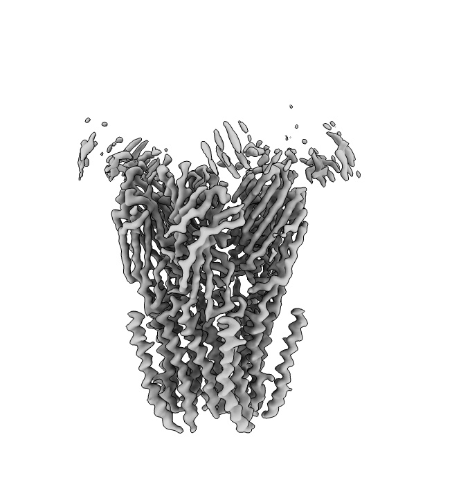
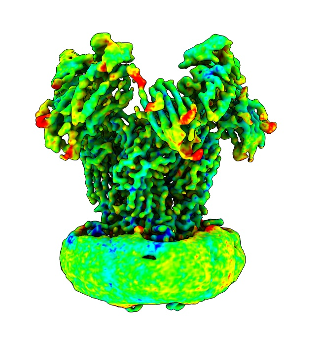

# Overview

  

    

    

    <input type="range" class="c-compare__range" min="0" max="100" value="50"
           oninput="this.parentNode.style.setProperty('--value', this.value + '%')"
           style="position: absolute; bottom: 10px; left: 10px; width: 90%; z-index: 10;" />
  

---

## What is LocScale2

The primary purpose of dlkkfklskflskfkle

What does the 'local scale'
