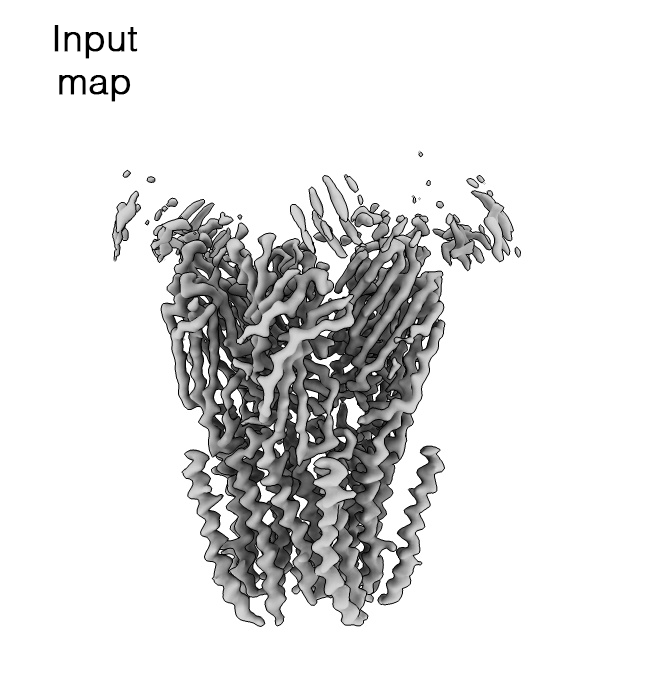

# LocScale 2.0 <br><sup>Confidence-weighted cryoEM map optimisation</sup> 
<div style="text-align: justify"><code>LocScale 2.0</code> is an automated program for physics-informed local sharpening and/or density modification of cryo-EM maps with the aim to improve their interpretability. It utilises general properties inherent to electron scattering from biological macromolecules to restrain the sharpening filter. These can be provided either from an existing atomic model, or inferred directly from the experimental density map. 
</div>

!!! info "What's new in LocScale 2.0"     
    - [Feature-enhanced maps](tutorials/fem.md): Confidence-weighted map optimisation by variational inference.
    - [Hybrid sharpening](tutorials/hybrid_locscale.md): Reference-based local sharpening with partial (incomplete) models.  
    - [Model-free sharpening](tutorials/model_free_locscale.md): Reference-based local sharpening without atomic models.
    - [LocScale-SURFER](https://locscale-surfer.readthedocs.io/): ChimeraX plugin to toggle contextual structure in ```LocScale``` maps
    - Complete automation of the map optimisation process
    - Full support for point group symmetry (helical symmetry to follow).

---

## Different flavours for different purposes

`LocScale 2.0` comes with different modes and flavours to perform map optimisation, each with its own advantages. Please browse through the description of the different modes for usage instructions and/or scroll down to a [brief guide](#flavour_guide) to choose the best method for your problem.<br>  

<div class="grid cards" markdown>

-   :material-fruit-pineapple:{ .lg .middle } __LocScale-FEM__  
    <ins>F</ins>eature-<ins>E</ins>nhanced <ins>M</ins>aps with confidence weighting. Recommended for most cases. 

    ---
    

    [:octicons-arrow-right-24: Locscale-FEM](tutorials/fem.md)

-   :material-fruit-watermelon:{ .lg .middle } __Hybrid LocScale__  
    Physics-based map optimisation optimally retaining contextual structure. 

    ---
    

    [:octicons-arrow-right-24: Hybrid LocScale](tutorials/hybrid_locscale.md)

-   :material-fruit-cherries:{ .lg .middle } __Model-free LocScale__  
    Automated local sharpening without model information. Fast and easy.

    ---
    

    [:octicons-arrow-right-24: Model-free Locscale](tutorials/model_free_locscale.md)

-   :material-fruit-pear:{ .lg .middle } __Model-based LocScale__  
    Legacy LocScale with model information. Still useful in many cases.

    ---
    

    [:octicons-arrow-right-24: Model-based LocScale](tutorials/model_based_locscale.md)

</div>

## How does LocScale 2.0 work?

<div style="text-align: justify">
<code>LocScale 2.0</code> integrates physics-informed and deep learning-based map optimisation. Physical priors for map sharpening are based on established knowledge about expected properties of electron scattering by biological macromolecules <a href="about/#references">[1-3]</a>. Alternatively, a deep convolutional neural network <a href="[https://your-site.com](https://gitlab.tudelft.nl/aj-lab/locscale/-/tree/master/locscale/emmernet)"><code>EMmerNet</code></a> trained on pairs of unmodified maps and maps optimised with the physics-informed scaling procedure can be used to predict local scale estimates. This information is then fed into a windowed scaling procedure to produce locally sharpened maps. Both of these workflows are map sharpening procedures operate in Fourier space, where structure factor amplitudes are corrected but map phases are locally unchanged. In a third workflow <a href="tutorials/fem.md"><code>LocScale-FEM</code></a>, a Bayesian-approximate implementation of <code>EMmerNet</code> is used to predict an optimised map (which we call <a href="tutorials/fem.md"><b>feature-enhanced map</b></a>) along with its uncertainties. This procedure operates in real space and affects both amplitudes phases akin to density modification. <code>LocScale 2.0</code> computes a voxel-wise confidence score that quantifies the uncertainty of this prediction, which can be mapped onto the map to guide interpretation. 
</div>
<br>

!!! info inline end "What are we looking at here?"
    Example of map optimisation with ```LocScale 2.0``` using the ```feature_enhance``` option. ```LocScale 2.0``` attempts to simultaneously enhance high-resolution structural detail and improve contrast of low(er) resolution map regions associated with flexible subunits, partial occupancy and contextual structure such as detergent micelles.

<div style="display: flex; flex-direction: column; align-items: left;">
  <div class="c-compare" style="--value:50%; position: relative; width: 400px; height: 333px; overflow: hidden;">
    

    

    <input type="range" class="c-compare__range" min="0" max="100" value="50"
           oninput="this.parentNode.style.setProperty('--value', this.value + '%')"
           style="position: absolute; bottom: 10px; left: 10px; width: 90%; z-index: 10;" />
  </div>
</div>
<br>


## Which map optimisation procedure should I use? {#flavour_guide}

```LocScale 2.0``` supports several different workflows for automated, physics-informed map optimisation. Three of them fall into the category of local sharpening methods, and one ––__feature-enhanced maps__–– is a map optimisation methods akin to density modification. The different methods serve different needs and we will try to guide choosing the right approach for different scenarios below.

<br>

<br>

In general we recommend using ```locscale_feature_enhance``` for map optimisation in ```LocScale 2.0``` whenever applicable. We have found this procedure to work robustly in a majority of cases and to provide the best compromise in preserving high-resolution detail and enhancing contrast of flexible or lower occupancy regions and contextual structures such as micelles.  


