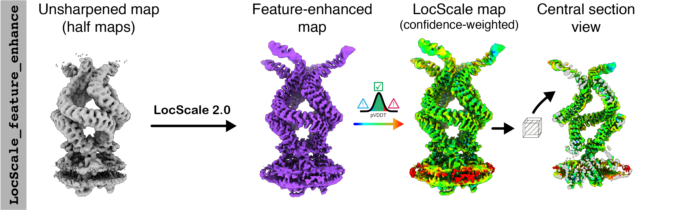
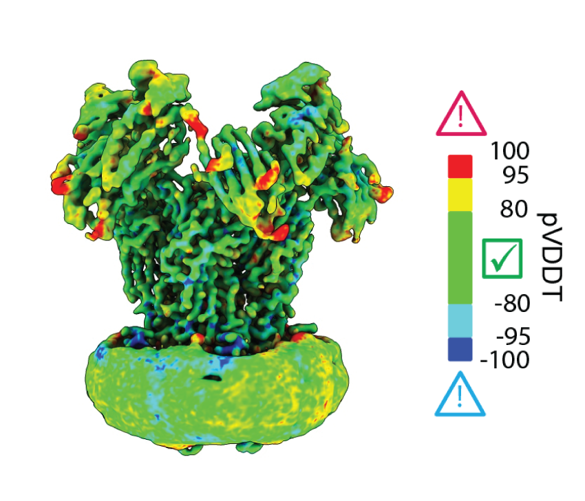

# Feature-enhanced maps<br><sup>Confidence-weighted map optimisation</sup>

LocScale also supports confidence-weighted density modification based on a Bayesian-approximate implementation of ```EMmerNet```, whiich strives to simultaneously optimise high-resolution detail and contrast of low(er) resolution map regions or contextual stucture. To mitigate any risk of bias from network hallucination, ```LocScale``` integrates this procedure with calculate a per-pixel [confidence score](#pvddt) that effectively highlights regions requiring cautious interpretation.
<br>

!!!info "Confidence-weighted map optimisation workflow (__Feature-enhanced maps__)"
    <br>
    

!!! warning "GPUs required"
    Use of this option requires the availability of GPUs. It is possible to run the predictions on CPU-only setups but this will be very slow.   


### Usage

```bash
locscale feature_enhance -hm path/to/halfmap1.mrc path/to/halfmap2.mrc -v -gpus 1 -o feature_enhanced.mrc
```

Here, ```halfmap1.mrc``` and ```halfmap2.mrc``` should be the unsharpened and unfiltered half maps from yourr 3D refinement. If you wish to use the full map instead, use the following command:

```bash
locscale -em path/to/fullmap.mrc -mc path/to/model.pdb -v -gpus 1 -o feature_enhanced.mrc
```

!!! note "Point group symmetry"
    If your map has point group symmetry, you need to specify the symmetry to force symmetrisation of the optimised map. You can do
    this by specifying the required point group symmetry using the `-sym/--symmetry` flag, e.g. for D2:

    ```bash
    locscale -hm path/to/halfmap1.mrc path/to/halfmap2.mrc -v -sym D2 -gpus 1 -o feature_enhanced.mrc
    ```

The output will be __feature-enhanced map__ along with its confidence scores that can be found in the file ```pvDDT.mrc```.

!!! warning "Recommended use of unfiltered input maps"
    Note that using unfiltered maps as input is essential. If using previously filtered maps, information beyond the spatial filter cutoff cannot be recovered.   


!!! tip "Speed-up computation on multiple CPUs"
    To speed up computation, you can use multiple CPUs if available. LocScale uses [OpenMPI](https://www.open-mpi.org/)/[`mpi4py`](https://mpi4py.readthedocs.io/en/stable/) for parallelisation, which should have been automatically set up during installation. You
    can run it as follows:

    ```bash
    mpirun -np 4 locscale -hm path/to/halfmap1.mrc path/to/halfmap2.mrc -v -gpus 1 -o feature_enhanced.mrc -mpi
    ```

### Interpreting pVDDT scores {#pvddt}

!!! info "pVDDT scores"
    `LocScale` Feature-Enhanced Maps computes a voxel-wise confidence level of the optimised map, which we call the predicted Voxel-Wise
    Difference Test (__pVDDT__) score. {==You should always inspect LocScale FEM maps together with its confidence scores as described
    below.==}  

#### Visualising confidence-weighted maps in ChimeraX
The best way to visualise confidence scores is using the surface colour option in ChimeraX. `LocScale` outputs the pVDDT scores in MRC format, withc each voxel representing the pVDDT score associated with it.  <br>

In ChimeraX, if your model #1 refers to the feature enhanced map (`locscale_output.mrc`) and model #2 refers to the pVDDT score map (`pVDDT.mrc`), use the following command to visualise the confidence score superimposed on the surface map:  

```bash 
color sample #1 map #2 palette -95, #0000ff; -80, #00ffff; 0, 00ff00; 80, #ffff00; 95, #ff0000;
```

!!! warning inline end "pVDDT score interpretation"
    pVDDT scores provide an intutive way for objective map interpretation by highlighting regions that may require caution because. these regions display density that significantly deviates from the density in amplitude-only modified maps. Note that these scores do not necessarily mean that these regions should not be interpreted, just that their confidence is low(er).   
{width=400}
