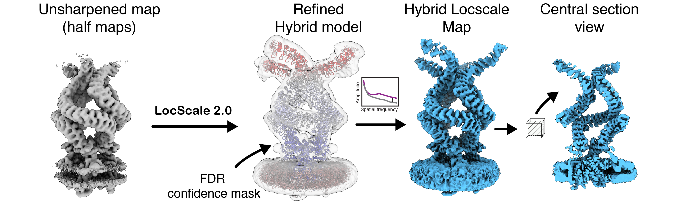

### Run LocScale using a partial atomic model
!!!info
    

```bash
locscale -hm path/to/halfmap1.mrc path/to/halfmap2.mrc -mc path/to/model.pdb -v -o model_based_locscale.mrc --complete_model
```

Here, emmap.mrc should be the unsharpened and unfiltered density map. If you wish to use the two half maps instead, use the following command:

```bash
locscale -hm path/to/halfmap1.mrc path/to/halfmap2.mrc -mc path/to/model.pdb -v -o model_based_locscale.mrc --complete_model
```
##### Symmetry
If your map has point group symmetry, you need to specify the symmetry to force the pseudomodel generator for produce a symmetrised reference map for scaling. You can do this by specifying the required point group symmetry using the `-sym/--symmetry` flag, e.g. for D2:

```bash
locscale -hm path/to/halfmap1.mrc path/to/halfmap2.mrc -mc path/to/model.pdb -v -sym D2 -o model_based_locscale.mrc --complete_model 
```

The output will be a locally sharpened map scaled according to the refined atomic B-factor distribution of the supplied atomic model.

To speed up computation, you can use multiple CPUs if available. LocScale uses [OpenMPI](https://www.open-mpi.org/)/[`mpi4py`](https://mpi4py.readthedocs.io/en/stable/) for parallelisation, which should have been automatically set up during installation. You can run it as follows:

```bash
mpirun -np 4 locscale -hm path/to/halfmap1.mrc path/to/halfmap2.mrc -mc path/to/model.pdb -v -o model_based_locscale.mrc  --complete_model -mpi
```

