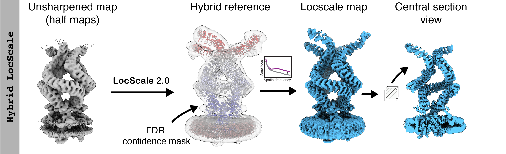

# Hybrid LocScale<br><sup>Reference-based local sharpening with a partial model</sup>

The hybrid ```LocScale``` workflow is useful in cases where partial model information is available but substantial map regions of interest or contextual densities cannot be modelled and/or are likely to fall outside the model generalisation of ```EMmerNet```, or in cases where optimal local sharpening using a physics-based amplitude scaling procedure is desired.
<br>

!!!info "Hybrid LocScale workflow"
    <br>
    

### Usage

```bash
locscale -hm path/to/halfmap1.mrc path/to/halfmap2.mrc -mc path/to/model.pdb -v -o model_based_locscale.mrc --complete_model
```

Here, ```halfmap1.mrc``` and ```halfmap2.mrc``` should be the unsharpened and unfiltered half maps from yourr 3D refinement. If you wish to use the full map instead, use the following command:

```bash
locscale -em path/to/fullmap.mrc -mc path/to/model.pdb -v -o model_based_locscale.mrc --complete_model
```

Note that in this case no half map validation can be performed for coordinate and ADP refinement of the hybrid model.

!!! warning "Recommended use of unfiltered input maps"
    Note that using unfiltered maps as input is essential. Information beyond the spatial filter cutoff cannot be recovered.
    
!!! note "Point group symmetry"
    If your map has point group symmetry, you need to specify the symmetry to force the pseudomodel generator for produce a symmetrised
    reference map for scaling. You can do this by specifying the required point group symmetry using the `-sym/--symmetry` flag, e.g.
    for D2:

    ```bash
    locscale -hm path/to/halfmap1.mrc path/to/halfmap2.mrc -mc path/to/model.pdb -v -sym D2 -o model_based_locscale.mrc --complete_model 
    ```

The output will be a locally sharpened map scaled according to the refined atomic B-factor distribution of the hybrid atomic/pseudoatom model.

!!! tip "Speed-up computation on multiple CPUs"
    To speed up computation, you can use multiple CPUs if available. LocScale uses [OpenMPI](https://www.open-mpi.org/)/[`mpi4py`
    (https://mpi4py.readthedocs.io/en/stable/) for parallelisation, which should have been automatically set up during installation. You
    can run it as follows:

    ```bash
    mpirun -np 4 locscale -hm path/to/halfmap1.mrc path/to/halfmap2.mrc -mc path/to/model.pdb -v -o model_based_locscale.mrc  --   complete_model -mpi
    ```
