# Running LocScale via CCPEM Doppio

```LocScale 2``` can be run via the [CCPEM Doppio](https://www.ccpem.ac.uk/docs/software/) interface. The CCPEM Doppio interface supports all four ```LocScale 2``` modes including the most relevant [advanced options](#advanced) for each mode.

### Step-by-step tutorial

In this example we will use the _Rattus norvegicus_ TRPV1 channel [EMDB 5778](https://www.ebi.ac.uk/emdb/EMD-5778) from the [EMDB map
and model challenge](https://zenodo.org/records/1185426). You can [download the tutorial files here](https://surfdrive.surf.nl/files/index.php/s/PkCe60os0Vc0HYh/download).

<div class="grid cards" markdown>

-   :material-numeric-1-box:{ .lg .top } __Open Doppio GUI__  

    ---
    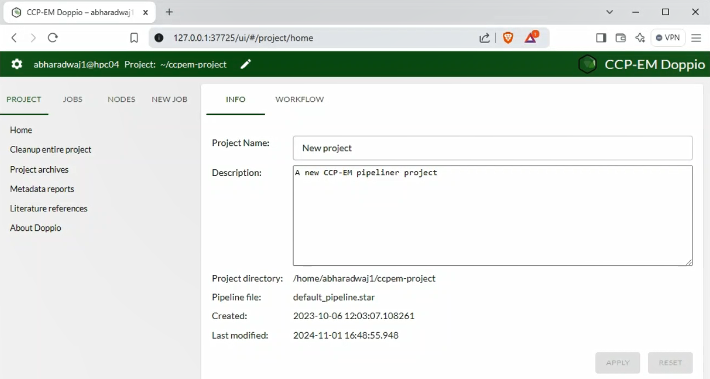
    After starting up the [CCPEM Doppio](https://www.ccpem.ac.uk/docs/software/) interface, start a new project.

-   :material-numeric-2-box:{ .lg .top } __Locate LocScale job node__  

    ---
    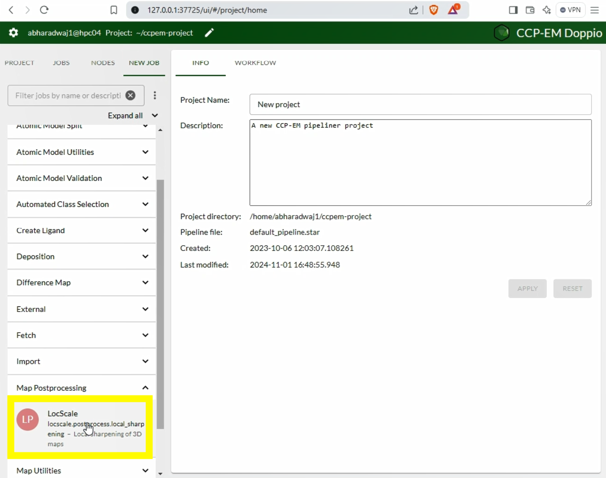
    ```LocScale``` is located under the _Map postprocessing_ tab in the program menu.

-   :material-numeric-3-box:{ .lg .top } __LocScale GUI__  
  
    ---
    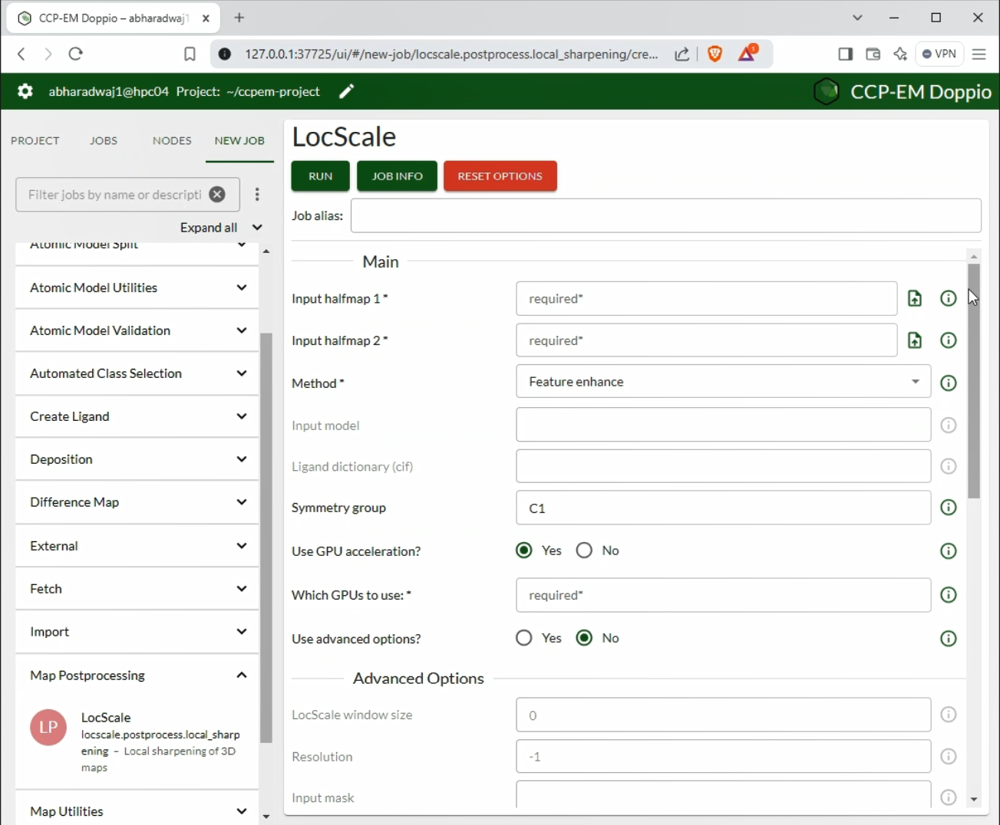
    The LocScale GUI provides dynamic access to set all relevant parameters depending on the ```LocScale``` mode used.<br>


-   :material-numeric-4-box:{ .lg .top } __Advanced options ON__  

    ---
    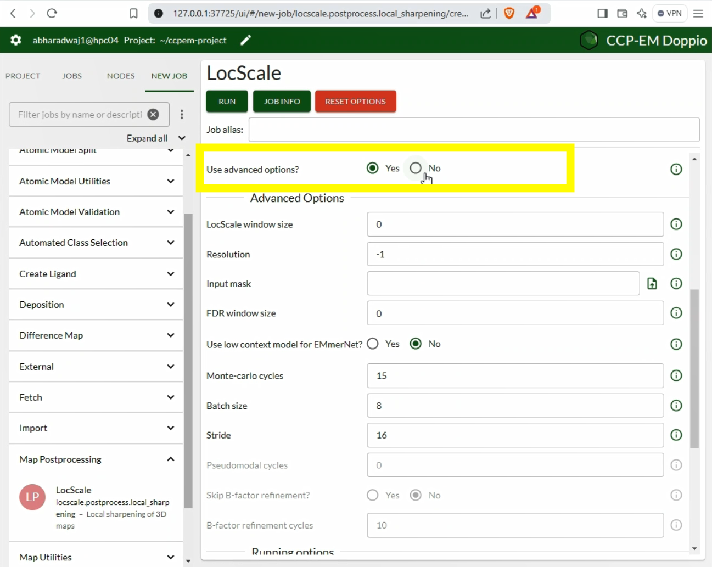
    You can toggle ON/OFF the Advanced Options menu. In most cases the default options will be just fine.

    [:octicons-arrow-right-24: Advanced Options](#advanced)
    

-   :material-numeric-5-box:{ .lg .top } __Advanced options OFF__  

    ---
    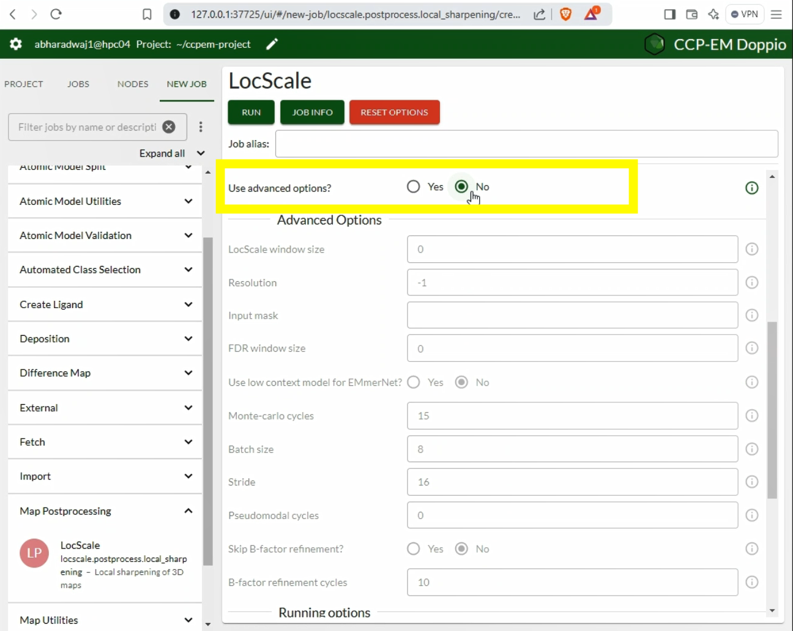
    We recommend to only change default parameters if really necessary. Here we will keep them turned off.

-   :material-numeric-6-box:{ .lg .top } __Select LocScale mode__  

    ---
    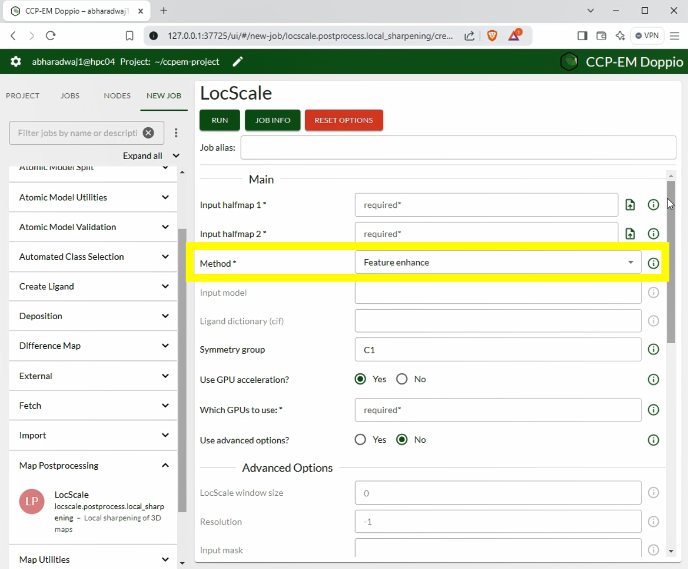
    In this case, choose __Feature_enhance__.

-   :material-numeric-7-box:{ .lg .top } __Upload all files__  
    Upload the relevant files. Fields will show which files are required depending on the method.

    ---
    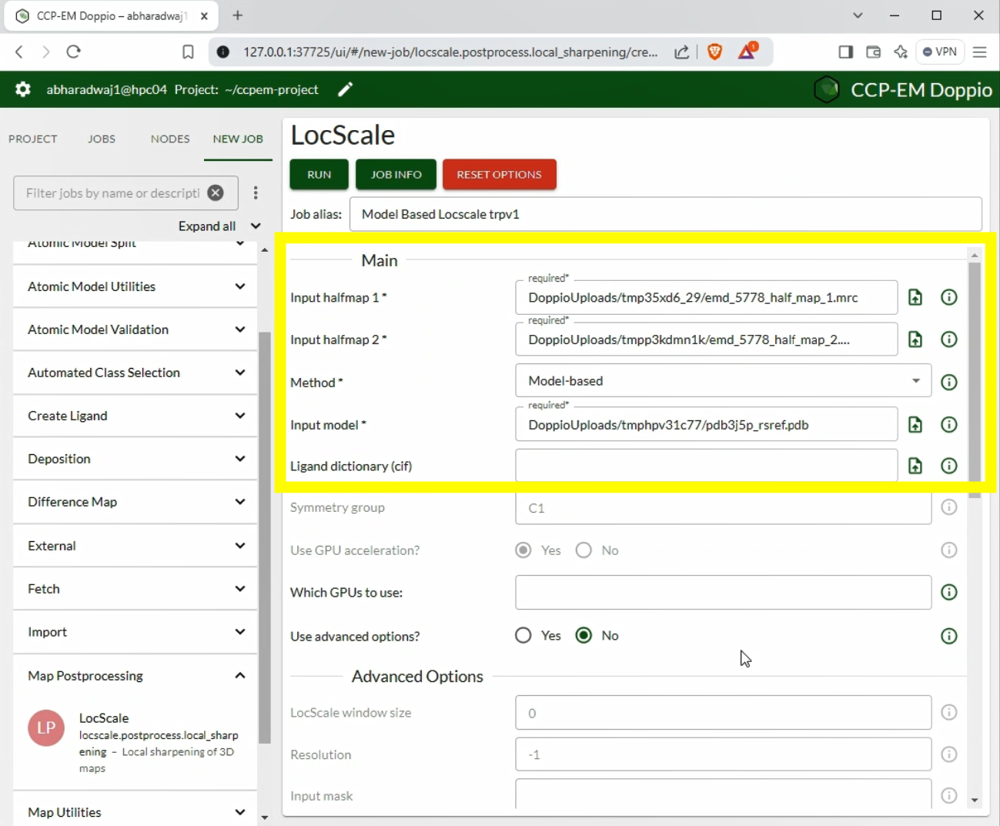

-   :material-numeric-8-box:{ .lg .top } __Set number of CPUs__  

    ---
    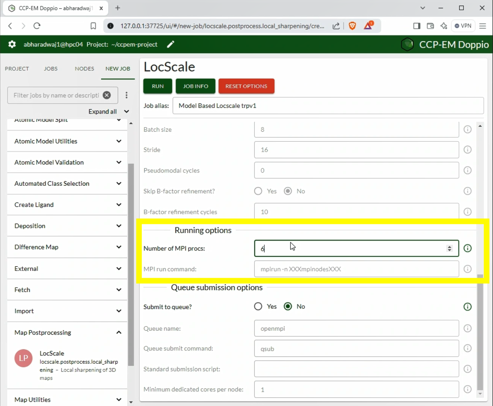
    For most maps, it is recommended to use multiprocessing. Increase the number of MPI processes to speed up the computation.

-   :material-numeric-9-box:{ .lg .top } __Run LocScale__  

    ---
    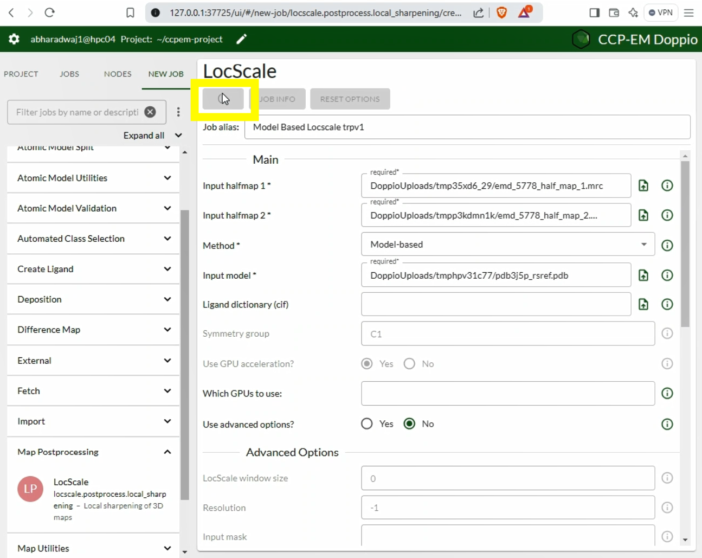
    Click the _Run_ button to start the job.

-   :material-numeric-1-box:{ .lg .top }:material-numeric-0-box:{ .lg .top } __Inspect Results__  

    ---
    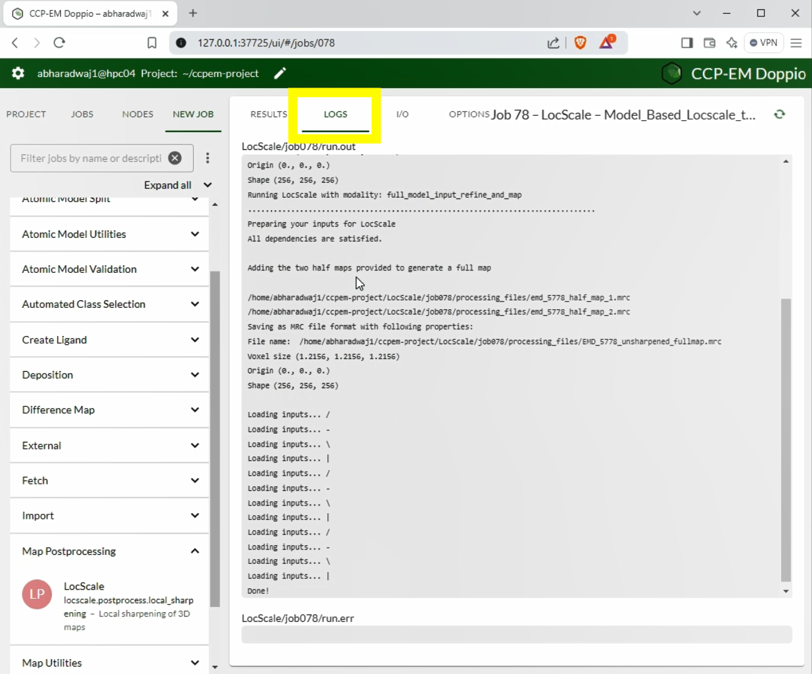
    Output from LocScale and any warnings/errors that it encounters will appear under _Logs_.

-   :material-numeric-1-box:{ .lg .top }:material-numeric-1-box:{ .lg .top } __Analyse 2D map slices__  

    ---
    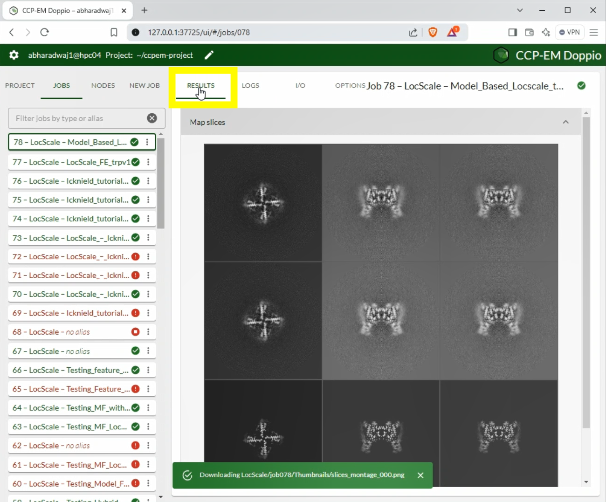
    View the slices of the input half-maps and the LocScale output maps.

-   :material-numeric-1-box:{ .lg .top }:material-numeric-2-box:{ .lg .top } __Inspect 3D density maps__  

    ---
    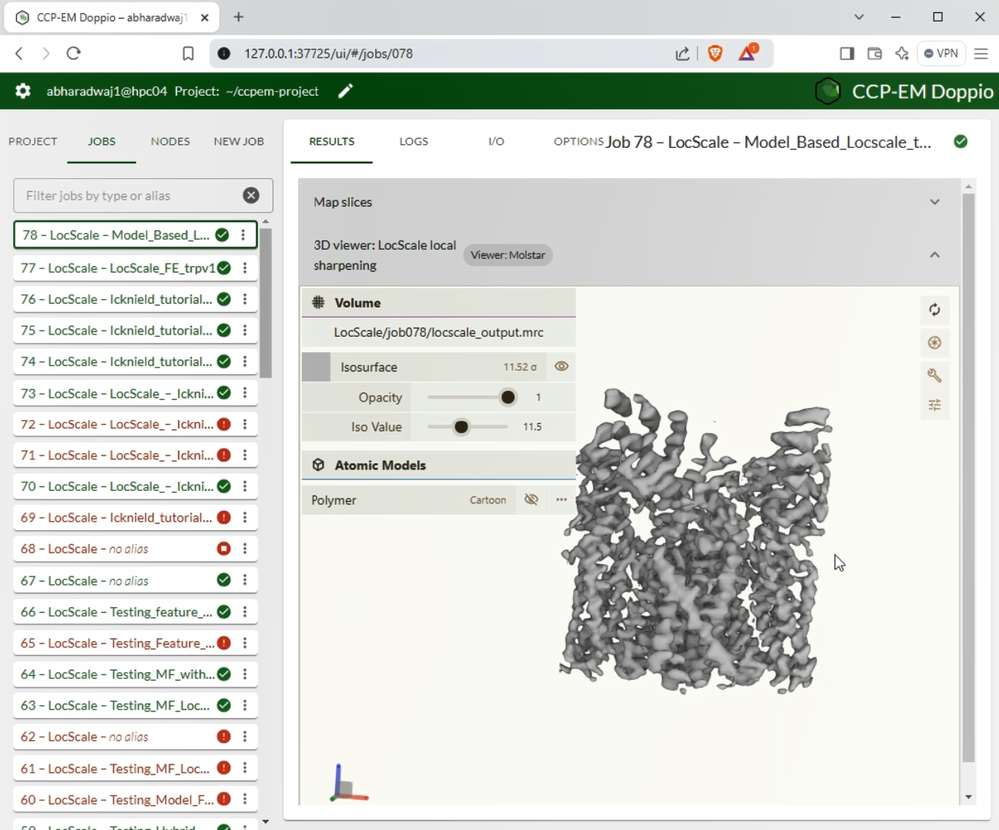
    Visualise the 3D structure of the output using _ChimeraX_ or _Coot_. Change the isosurface threshold for better viewing. The typical range for maps produced by LocScale for best visualisation is between 0.05 and 0.15.

</div>

### Advanced options in CCPEM Doppio {#advanced}

:material-fruit-pineapple:{.lg .top }:  LocScale-FEM   
:material-fruit-watermelon:{.lg .top }: Hybrid LocScale  
:material-fruit-cherries:{.lg .top }: Model-free LocScale  
:material-fruit-pear:{.lg .top }: Model-based LocScale  


| Option                   | Notes                                | Affected Method |
| -------------------------| ------------------------------------ |---------------------------|
| `LocScale window size`  | Choose an even number. Preferable range is between 16 and 30     | :material-fruit-pineapple:{.lg .top }, :material-fruit-watermelon:{.lg .top }, :material-fruit-cherries:{.lg .top },  :material-fruit-pear:{.lg .top } |
| `Resolution`            | Halfmap resolution at FSC=0.143 | :material-fruit-watermelon:{.lg .top } :material-fruit-pear:{.lg .top } |
| `Input mask`            | Upload a mask or choose from dropdown. If uploaded, mask should be binarised. | :material-fruit-pineapple:{.lg .top }, :material-fruit-watermelon:{.lg .top }, :material-fruit-cherries:{.lg .top },  :material-fruit-pear:{.lg .top } |
| `FDR window size`       | Window size to calculate noise statistics. Preferable range > 15. | | `Input mask`            | Upload a mask or choose from dropdown. If uploaded, mask should be binarised. | material-fruit-pineapple:{.lg .top }, :material-fruit-watermelon:{.lg .top }, :material-fruit-cherries:{.lg .top },  :material-fruit-pear:{.lg .top } |
| `Use low context model` | Uses ```EMmerNet``` model trained with low context data. Choose this is for high resolution data with few low order/resolution regions. | :material-fruit-pineapple:{.lg .top } :material-fruit-cherries:{.lg .top } |
| `Monte-Carlo cycles`    | Number of samples used to predict variance using MC dropout. Useful range > 8. | :material-fruit-pineapple:{.lg .top } |
| `Batch size`            | Number of batches to hold in GPU.  For a single GPU of size 12GB, a batch size of 8 is optimum.<brr> If using multiple GPUs, the total batch size is distributed across all GPUs. For instance, with 3 GPUs of size 12GB, the input should be 24 (3x8) | :material-fruit-pineapple:{.lg .top } :material-fruit-cherries:{.lg .top } |
| `Stride`                | Distance between successive cubes to sample the reconstruction box.  Higher strides accelerate computation, but might contain more striding artefacts. Max value 31. | :material-fruit-pineapple:{.lg .top } :material-fruit-cherries:{.lg .top } |
| `Pseudomodel cycles`    | Number of gradient descent iteration steps to create a pseudo-model over the unmodelled parts of the input. Preferable range > 20 | :material-fruit-watermelon:{.lg .top } |
| `Skip B-factor refinement` | Choose this option if you are confident about the B-factor distribution of the input model. | :material-fruit-pear:{.lg .top } |
| `ADP refinement cycles`    | Number of REFMAC refinement cycles to model the B-factor distribution.  Preferable range > 5. | :material-fruit-watermelon:{.lg .top } :material-fruit-pear:{.lg .top } |


### LocScale Doppio tutorials {#advanced}

In the following we will run through a few modes of `LocScale` in the Doppio interface to inspect the result of sharpening and/or
density modification and discuss some aspects to consider.

#### Model-free LocScale (CCPEM tutorial)

Model-free LocScale is the simplest and the quickest approach. It is good to get a quick first idea if local sharpening can improve your map, but we recommend other modes for final map improvement.

- From the main GUI launch the LocScale task window.
- Enter the following parameters and hit _Run_:

```bash
Input halfmap 1: emd5778_half_map_1.mrc
Input halfmap 2: emd5778_half_map_2.pdb
{==Method: Model-free==}
Symmetry group: C4
Use GPU acceleration: No
Use MPI: True
MPI nodes: 3 (or 4)
```

The computations can be sped up by using parallel processing via MPI. Choose this option if your computer has multiple processors available. Note that if you have a symmetric map you need to specify the point group symmetry. To test why, you can also try re-running the job with C1 symmetry. Compare the map to the initial starting map (i.e. one of the half maps). Do you see any improvement?

#### Hybrid LocScale (CCPEM tutorial)

Hybrid-mode `LocScale` is a powerful approach if you have (partial) model information available. It typically is slow as it requires refining ADPs of the pseudo-atomic model, but it is the method of choice if your map contains large unmodellled areas and/or map modifications that may not have been seen yet by the `EMmerNet` training set. In this case we will use partial atomic model that only covers the well-defined transmembrane region of the TRPv1 channel.

- From the main GUI launch the LocScale task window.
- Enter the following parameters and hit run:

```bash
Input halfmap 1: emd5778_half_map_1.mrc
Input halfmap 2: emd5778_half_map_2.pdb
{==Method: Hybrid==}
Input model: pdb3j5p_incompl.pdf
Symmetry group: C4
Use GPU acceleration: No
Use MPI: True
MPI nodes: 3 (or 4)
```

Compare the map to the initial starting map (i.e. one of the half maps) and to the model-free map from the previous run. How do they compare? To better understand the rationale behind using the hybrid mode, try re-running the job with the same parameters but specify model-based as the selected method.

#### LocScale-FEM (CCPEM tutorial)

This is the default mode for LocScale2 and this mode will perform confidence-weighted density modification (i.e. it goes beyond just rebalancing the Fourier amplitude spectrum. 

!!! warning "Confidence scores"
    Note that you should always inspect LocScale FEM maps together with its confidence scores as described below.

Run LocScale in feature_enhance mode using following options:  

```bash
Input halfmap 1: emd5778_half_map_1.mrc
Input halfmap 2: emd5778_half_map_2.pdb
Method: Feature enhance
Symmetry group: C4
Use GPU acceleration: Yes
Which GPUs to use: 0
```

After running you will observe the following output message in the _Logs_:


