# Running LocScale via CCPEM Doppio

```LocScale 2``` can be run via the [CCPEM Doppio](https://www.ccpem.ac.uk/docs/software/) interface. CCPEM Doppio support all four ```LocScale 2 modes``

### LocScale in CCPEM tutorial

In this example we will use the Rattus norvegicus TRPV1 channel [EMDB 5778](https://www.ebi.ac.uk/emdb/EMD-5778) from the [EMDB map
and model challenge](https://zenodo.org/records/1185426).

<div class="grid cards" markdown>

-   :material-numeric-1-box:{ .lg .top } __Open Doppio GUI__  

    ---
    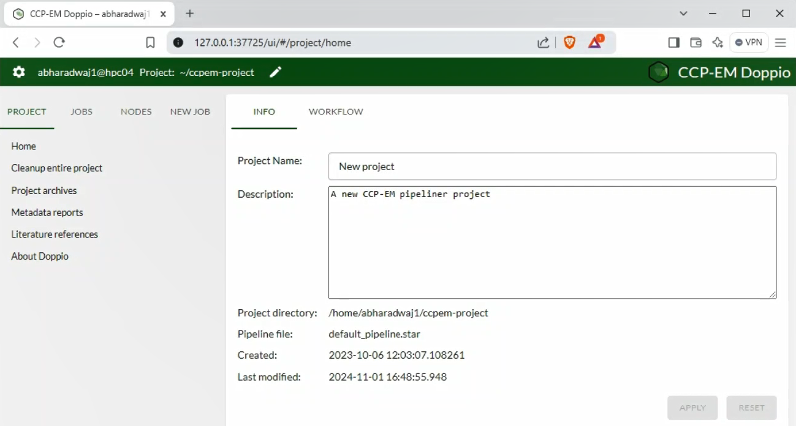

-   :material-numeric-2-box:{ .lg .top } __Locate locScale job node__  

    ---
    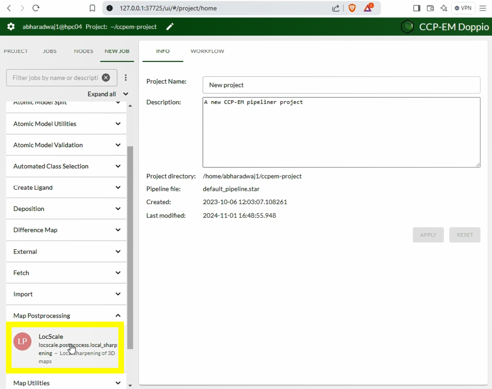

-   :material-numeric-3-box:{ .lg .top } __LocScale GUI__  
    The LocScale GUI provides dynamic access to set all relevant parameters.

    ---
    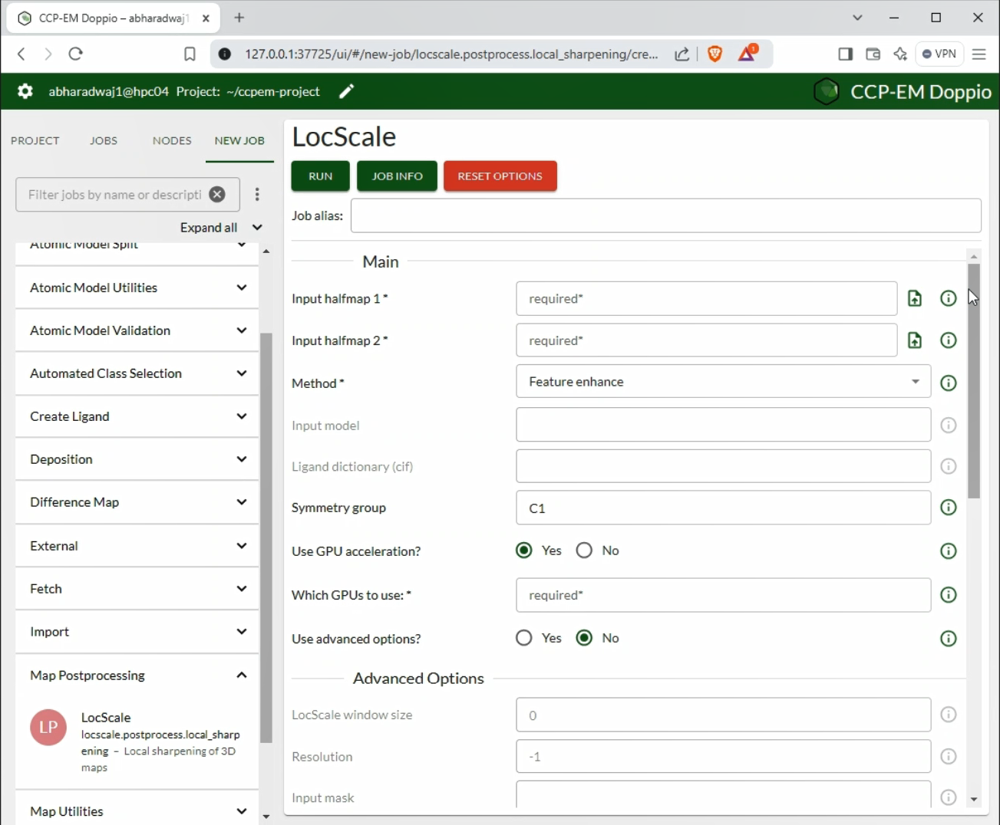

-   :material-numeric-4-box:{ .lg .top } __Advanced options ON__  
    This is how it continues 

    ---
    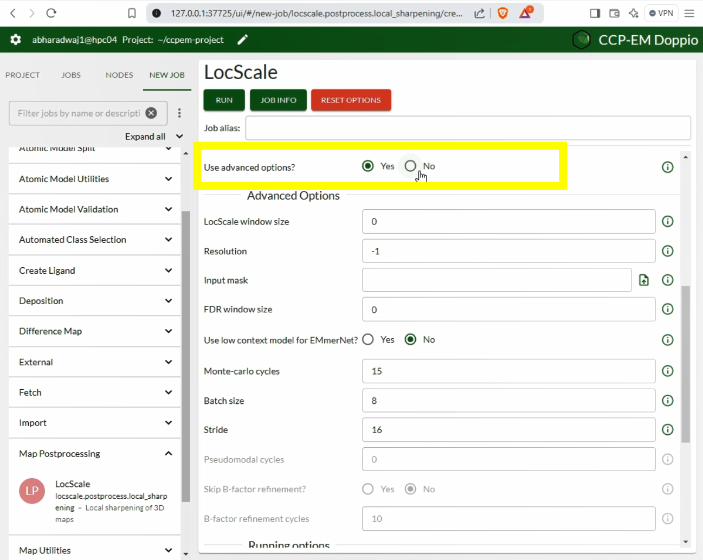

-   :material-numeric-5-box:{ .lg .top } __Advanced options OFF__  
    This is hopw it starts

    ---
    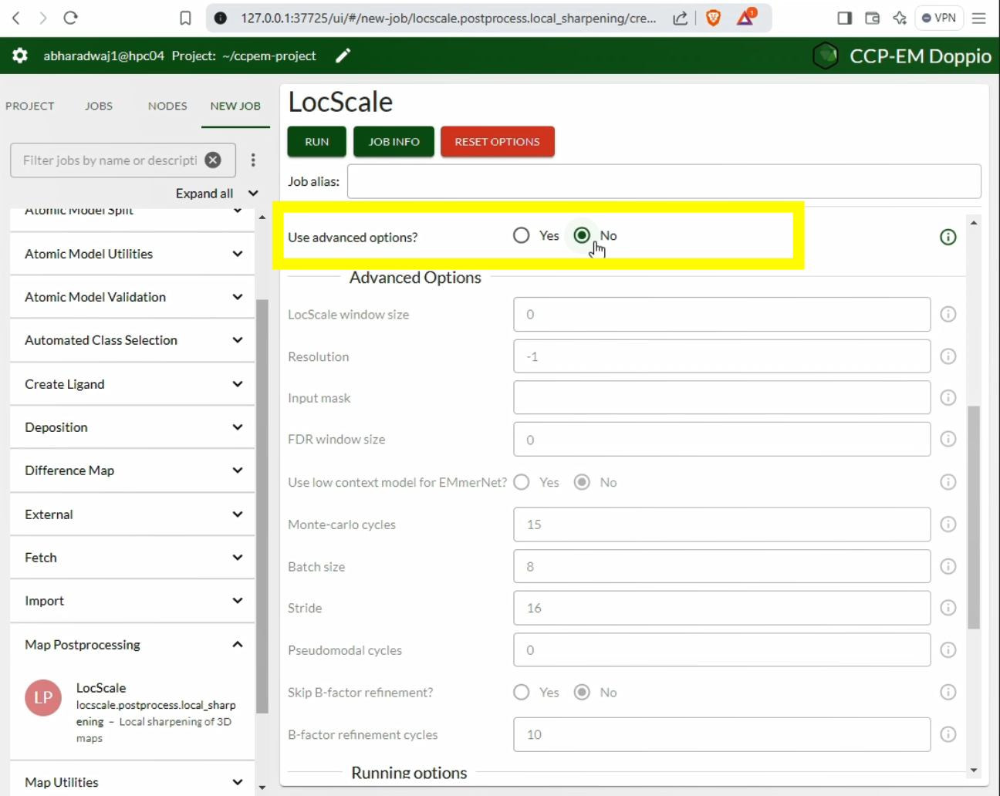

-   :material-numeric-6-box:{ .lg .top } __Select LocScale mode__  
    This is how it continues 

    ---
    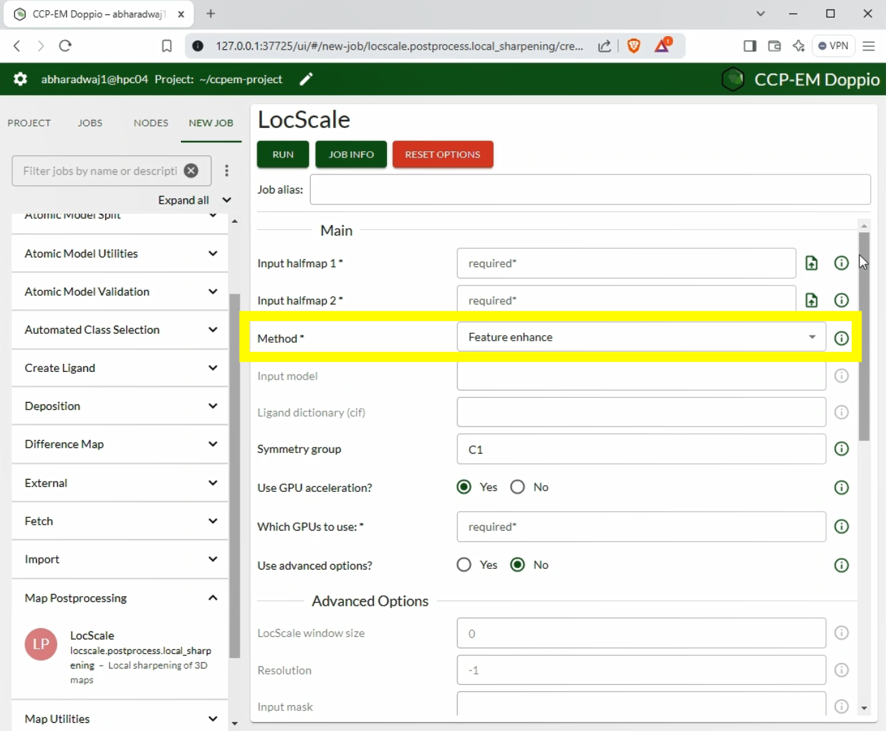

-   :material-numeric-7-box:{ .lg .top } __Upload all files__  
    This is hopw it starts

    ---
    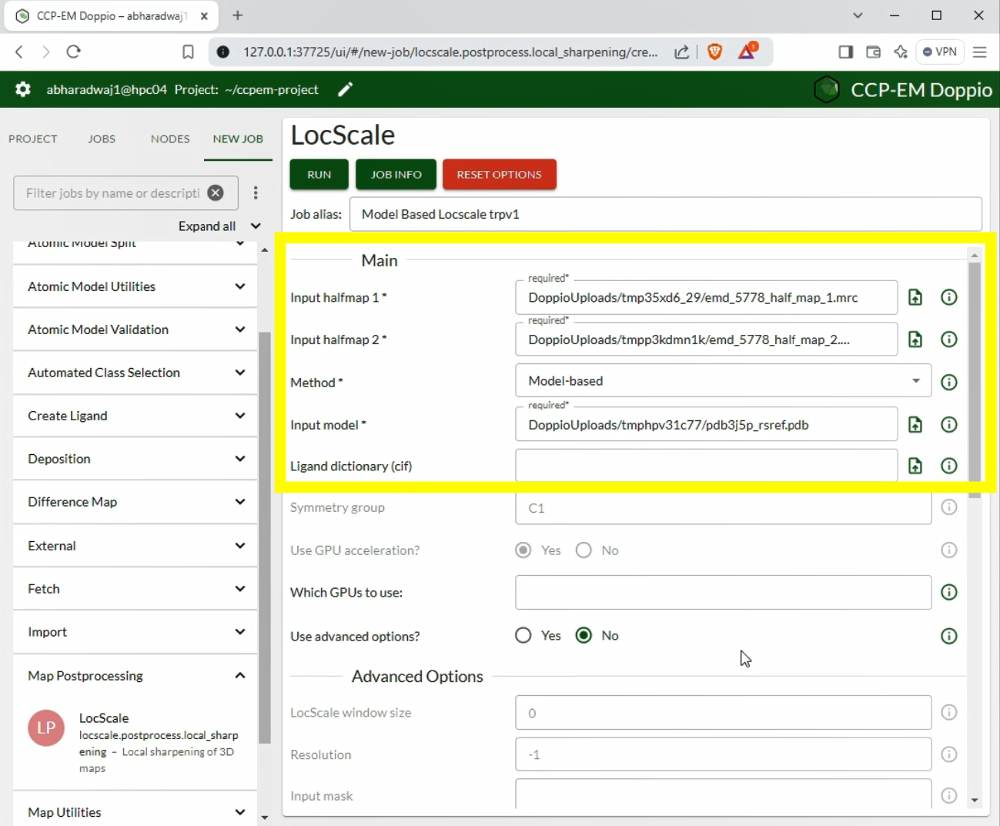

-   :material-numeric-8-box:{ .lg .top } __Set number of CPUs__  
    This is how it continues 

    ---
    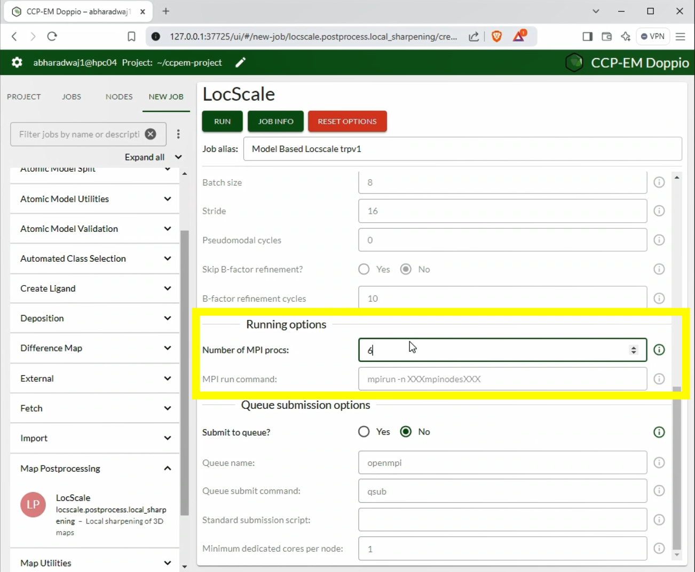

-   :material-numeric-9-box:{ .lg .top } __Run LocScalle__  
    This is hopw it starts

    ---
    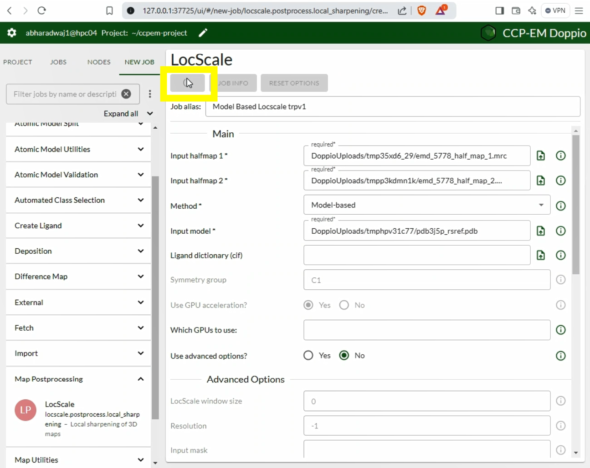

-   :material-numeric-1-box:{ .lg .top }:material-numeric-0-box:{ .lg .top } __Inspect Results__  
    This is how it continues 

    ---
    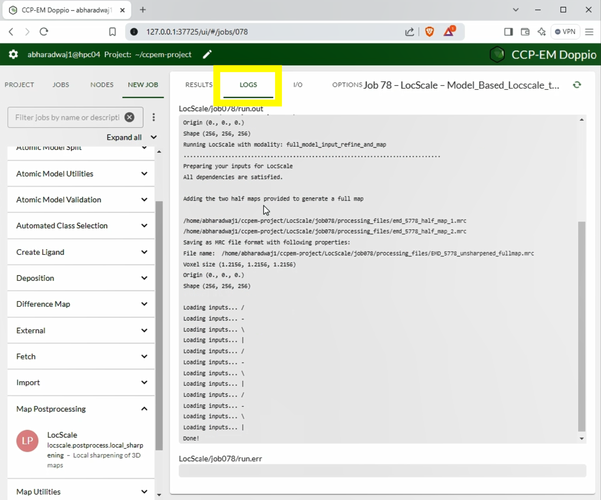

-   :material-numeric-1-box:{ .lg .top }:material-numeric-1-box:{ .lg .top } __XXX__  
    View the slices of the input half-maps and the LocScale output.

    ---
    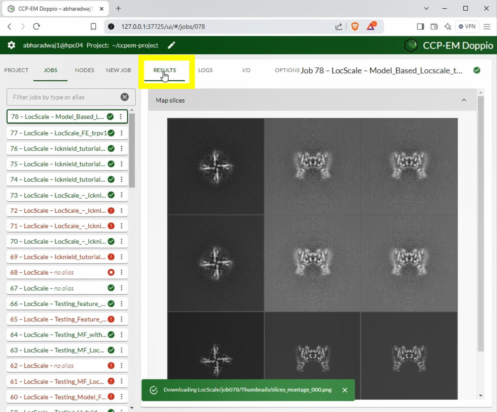

-   :material-numeric-1-box:{ .lg .top }:material-numeric-2-box:{ .lg .top } __YYY__  
    Visualise the 3D structure of the output. Change the isosurface threshold for better viewing. Typical range for maps produced by         LocScale for best visualisation is between 0.05 and 0.15

    ---
    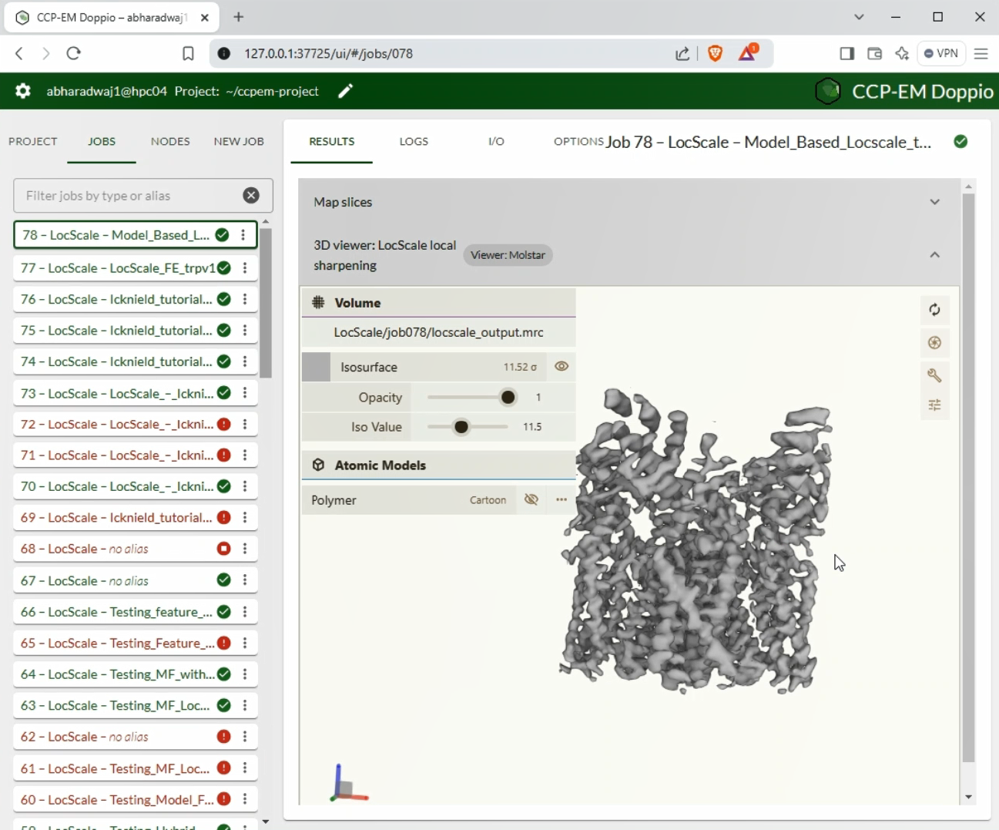

</div>
