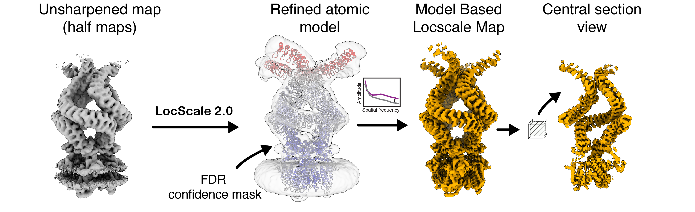

# Model-based LocScale<br><sup>Model-based local sharpening</sup>

Model-based sharpening is the legacy mode of local sharpening as originally introduced for the first version of LocScale descrirbed in this [paper](https://elifesciences.org/articles/27131). In `LocScale 2.0`, model-based sharpening can be run in a completely automated procedure, including robust ADP refinement of the input model. Model-based LocScale can still be a very useful sharpening tool in cases where atomic models have been fitted, but the map displays substantial resolution variation. 
<br>



### Usage 

```bash
locscale -hm path/to/halfmap1.mrc path/to/halfmap2.mrc -mc path/to/model.pdb -v -o model_based_locscale.mrc
```

Here, emmap.mrc should be the unsharpened and unfiltered density map. If you wish to use the two half maps instead, use the following command:

```bash
locscale -hm path/to/halfmap1.mrc path/to/halfmap2.mrc -mc path/to/model.pdb -v -o model_based_locscale.mrc
```
The output will be a locally sharpened map scaled according to the refined atomic B-factor distribution of the supplied atomic model.

!!! warning "Recommended use of unfiltered input maps"
    Note that using unfiltered maps as input is essential. If using previously filtered maps, information beyond the spatial filter cutoff cannot be recovered.


!!! note "Point group symmetry"
    If your map has point group symmetry, you need to specify the symmetry to force a symmetrised reference map for scaling. You can do
    this by specifying the required point group symmetry using the `-sym/--symmetry` flag, e.g. for D2:

    ```bash
    locscale -hm path/to/halfmap1.mrc path/to/halfmap2.mrc -mc path/to/model.pdb -v -sym D2 -o model_based_locscale.mrc
    ```


!!! tip "Speed-up computation on multiple CPUs"
    To speed up computation, you can use multiple CPUs if available. LocScale uses [OpenMPI](https://www.open-mpi.org/)/[`mpi4py`](https://mpi4py.readthedocs.io/en/stable/) for parallelisation, which should have been automatically set up during installation. You can run it as follows:

     ```bash
     mpirun -np 4 locscale -hm path/to/halfmap1.mrc path/to/halfmap2.mrc -mc path/to/model.pdb -v -o model_based_locscale.mrc -mpi
     ```
    If use of OpenMPI is not possible on your system, you can still take advantage of multiple CPU cores by using `joblib`. In this case, simply specify the number of CPU cores using the `-np` flag as follows:
    
    ```bash
    locscale -hm path/to/halfmap1.mrc path/to/halfmap2.mrc -mc path/to/model.pdb -np 4 -v -o model_based_locscale.mrc
    ```

