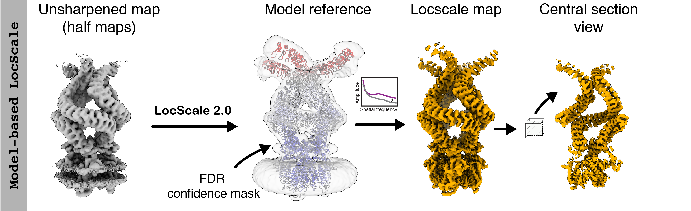

# Model-based LocScale<br><sup>Model-based local sharpening</sup>

Model-based sharpening is the legacy mode of local sharpening as originally introduced for the first version of LocScale descrirbed in this [paper](https://elifesciences.org/articles/27131). In `LocScale 2.0`, model-based sharpening can be run in a completely automated procedure, including robust ADP refinement of the input model. Model-based LocScale can still be a very useful sharpening tool in cases where atomic models have been fitted, but the map displays substantial resolution variation. 
<br>



### Usage 

```bash
locscale -hm path/to/halfmap1.mrc path/to/halfmap2.mrc -mc path/to/model.pdb -v -o model_based_locscale.mrc
```

Here, emmap.mrc should be the unsharpened and unfiltered density map. If you wish to use the two half maps instead, use the following command:

```bash
locscale -hm path/to/halfmap1.mrc path/to/halfmap2.mrc -mc path/to/model.pdb -v -o model_based_locscale.mrc
```

The output will be a locally sharpened map scaled according to the refined atomic B-factor distribution of the supplied atomic model.

To speed up computation, you can use multiple CPUs if available. LocScale uses [OpenMPI](https://www.open-mpi.org/)/[`mpi4py`](https://mpi4py.readthedocs.io/en/stable/) for parallelisation, which should have been automatically set up during installation. You can run it as follows:

```bash
mpirun -np 4 locscale -hm path/to/halfmap1.mrc path/to/halfmap2.mrc -mc path/to/model.pdb -v -o model_based_locscale.mrc -mpi
```
